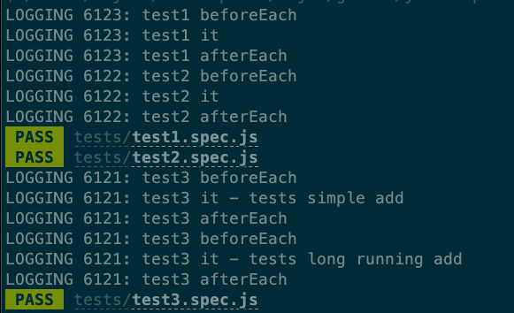
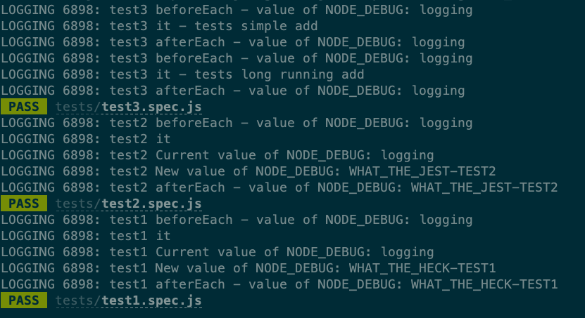
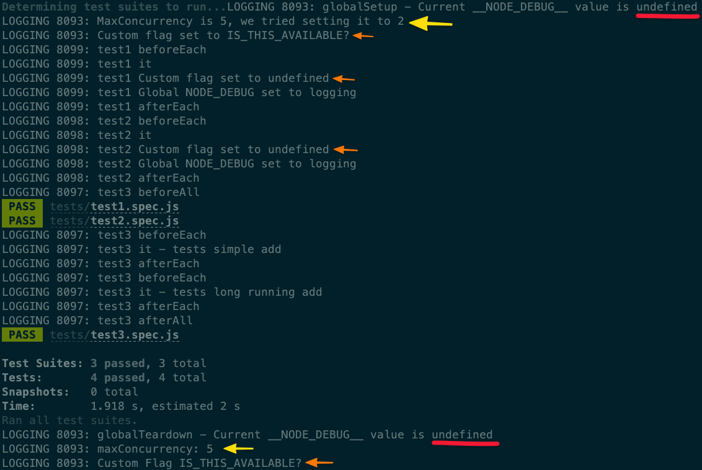
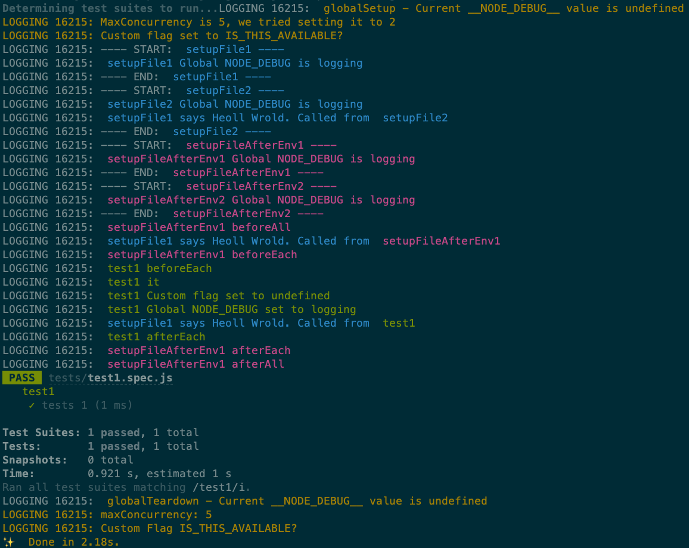
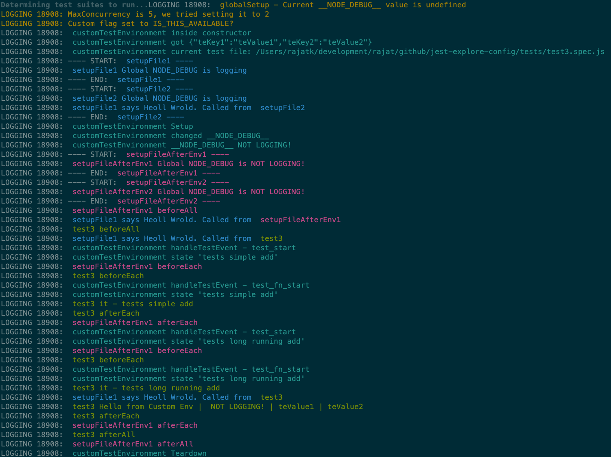

# Explore Jest Config and Lifecycle

## Simple Setup

-   Checkout `simple_setup` branch
-   yarn install

Run:

```sh
yarn tl
```

You should see some logs show up and this should give you some idea of the lifecycle.



🎉🎉 Congrats! You have a working setup!

## Explore Global Variables

([`global` Documentation](https://jestjs.io/docs/en/configuration#globals-object))

Set of `global` variables → made available in all test environments

-   Checkout `explore_globals` branch
-   See `jest.config.js`

```js
module.exports = {
    globals: {
        __NODE_DEBUG__: process.env.NODE_DEBUG,
    },
};
```

-   Accessing `__NODE_DEBUG__` value

```js
console.log(`Current __NODE_DEBUG__ value is ${global.__NODE_DEBUG__}`);
```

Try running:

-   `yarn tl`
-   `yarn tlb` (this runs the tests one after another and uses `--runInBand`)

Result:

-   Any mutation won't reflect between tests (even in the same test runs) although the mutation will be reflected for that particular test file
    -   so any changes in `it` block is seen in `afterEach` block
-   Values for global variables must be json-serializable.
    -   You can't create a `function` and try using this `function` in your test!
    -   Use `setupFiles` config instead



## Explore Global Setup and Global Teardown

([`globalSetup` Documentation](https://jestjs.io/docs/en/configuration#globalsetup-string))
([`globalTeardown` Documentation](https://jestjs.io/docs/en/configuration#globalteardown-string))

-   Checkout `global_setup_teardown` branch
-   See `jest.config.js`

```js
    globalSetup: './configFiles/globalSetup.js',
    globalTeardown: './configFiles/globalTeardown.js',
```

Try running:

-   `yarn tl`
-   `yarn tlb`

Results:

-   Any `global` variable defined in `globalSetup` can be read in `globalTeardown` but it cannot be read by any of the tests or test-suite
-   `global` variable defined in `jest.config.js` cannot be read in `globalSetup` and `globalTeardown`
-   Execution Sequence: `globalSetup` → ...[`beforeAll`, `beforeEach`, `test`, `afterEach`, `afterAll`]... → `globalTeardown`
-   `globalConfig` passed to `globalSetup` and `globalTeardown` functions cannot bo modified!



## Explore SetupFiles and SetupFilesAfterEnv

([`setupFiles` Documentation](https://jestjs.io/docs/en/configuration.html#setupfiles-array))
([`setupFilesAfterEnv` Documentation](https://jestjs.io/docs/en/configuration.html#setupfilesafterenv-array))

-   Checkout `setupfiles` branch
-   See `jest.config.js`

```js
    setupFiles: ['./configFiles/setupFile1.js', './configFiles/setupFile2.js'],
    setupFilesAfterEnv: [
        './configFiles/setupFileAfterEnv1.js',
        './configFiles/setupFileAfterEnv2.js',
    ],
```

Try running:

-   `yarn tlb` (`--runInBand` to see the behavior)

Result:

-   `setupFiles` and `setupFileAfterEnv` can access variables declared using `global`
-   `setupFiles` can be used to create and set functions on `global` and these can be accessed in `setupFilesAfterEnv` as well as in your Test files (ex: `funnyHelloWorld` function created by `setupFile1.js`)
-   `setupFiles` and `setupFileAfterEnv` are executed before each test file
-   `setupFiles` is expected to be used to run some code to setup your environment before every test is run
    -   you don't have access to functions like `beforeAll`, `beforeEach`, `afterAll`, `afterEach`
-   `setupFilesAfterEnv` is expected to be used to configure the testing framework before each test file but after the the testing framework is installed in the environment. Think of it as the right place to run some common code that needs to happen for every test to customize the testing framework for your needs.
    -   you have access to functions like `beforeAll`, `beforeEach`, `afterAll`, `afterEach`
-   Lifecycle looks like:
    -   globalSetup
    -   For each test file
        -   setupFile
        -   setupFileAfterEnv
        -   beforeAll from setupFileAfterEnv
        -   beforeAll from test file
        -   beforeEach from setupFileAfterEnv
        -   beforeEach from test file
        -   set of test from the file
        -   afterEach from test file
        -   afterEach from setupFileAfterEnv
        -   afterAll from test file
        -   afterAll from setupFileAfterEnv
    -   globalTeardown



## Explore Test Environment

([`testEnvironment` Documentation](https://jestjs.io/docs/en/configuration#testenvironment-string))
([`testEnvironmentOptions` Documentation](https://jestjs.io/docs/en/configuration#testenvironmentoptions-object))

-   Checkout `explore_globals` branch
-   run `yarn install`
-   See `jest.config.js`

```js
    testEnvironment: './configFiles/customTestEnvironment.js',
    testEnvironmentOptions: {
        teKey1: 'teValue1',
        teKey2: 'teValue2',
    },
    testRunner: 'jest-circus/runner', // we are including this as well!
```

Try running:

-   `yarn tl`

Result:

-   Lifecycle looks like:
    -   globalSetup
    -   For each test file
        -   customTestEnvironment is instantiated: `constructor`
        -   setupFile
        -   customTestEnvironment `setup`
        -   setupFileAfterEnv
        -   beforeAll from setupFileAfterEnv
        -   beforeAll from test file
        -   customTestEnvironment `handleTestEvent` - test_start
        -   beforeEach from setupFileAfterEnv
        -   beforeEach from test file
        -   customTestEnvironment `handleTestEvent` - test_fn_start
        -   set of tests from the file
        -   afterEach from test file
        -   afterEach from setupFileAfterEnv
        -   afterAll from test file
        -   afterAll from setupFileAfterEnv
        -   customTestEnvironment `teardown`
    -   globalTeardown
-   `runScripts` is not used if `getVmContext` is defined in customTestEnvironment
-   `handleTestEvent` is used by `jest-circus/runner` and if it is not set as your runner, this function is never called
-   `setup` can be used to set up more variables or functions on global (example, we set up `__NEW_VALUE__` in our code) and they will be available in tests for consumption
-   values passed using `testEnvironmentOptions` in `jest.config.js` can be accessed in `customTestEnvironment` and in our tests as well


